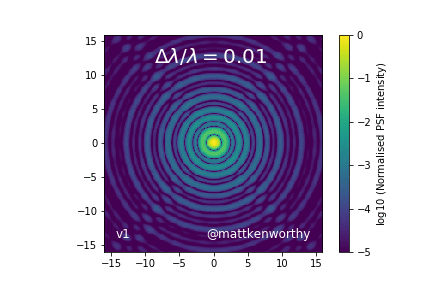
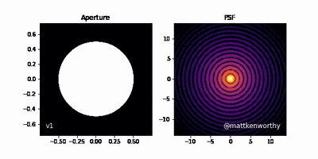

# Astronomical Optics Animations

Matthew Kenworthy - Leiden Observatory - kenworthy@strw.leidenuniv.nl

Animations made with `hcipy` to demonstrate optical principles in telescopes.

## Dependencies

`hcipy` https://hcipy.org/ is a Python package designed to simulate optical propagation in high contrast imaging applications. It is used by several astronomical institutes to simulate coronagrahs and adaptive optic systems for both ground and space based telescopes.

`numpy`

`ffmpeg` is used to make the animations.

`progressbar2` tracks how long the animations take.

## Acknowledgement

Feel free to distribute these animations.
If you use these in your lectures, please include an attribution "Animations by M. Kenworthy / Leiden Observatory"

